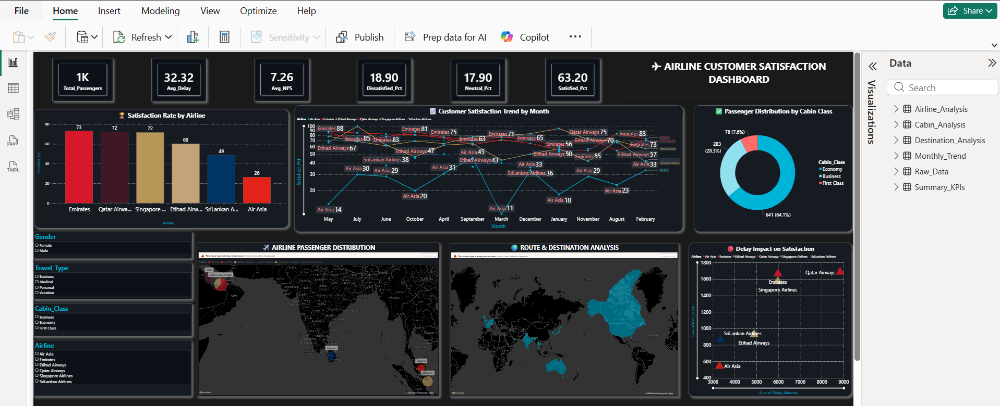

# ✈️ Airline Customer Satisfaction Analysis Dashboard | Power BI

## 📌 Project Overview

This Power BI dashboard analyzes airline customer satisfaction using an interactive and visually engaging dashboard. The project explores passenger satisfaction trends, airline performance, delays, cabin class preferences, and route analysis.

---

## 🛠️ Tools & Technologies

- Microsoft Power BI
- DAX
- Power Query
- Excel
- Data Modeling

---

## 📊 Dashboard Preview

---

## 📈 Key Insights

- Emirates achieved the highest customer satisfaction rate.
- Flight delays negatively impacted customer satisfaction.
- Business Class passengers recorded higher satisfaction.
- Air Asia recorded the lowest satisfaction among selected airlines.

---

## 📂 Files Included

- Airline_Customer_Satisfaction_Dashboard.pbix
- Airline_Satisfaction_UPGRADED.xlsx
- Dashboard.png

---

## 👩‍💻 Author

**Adini Uththara**
